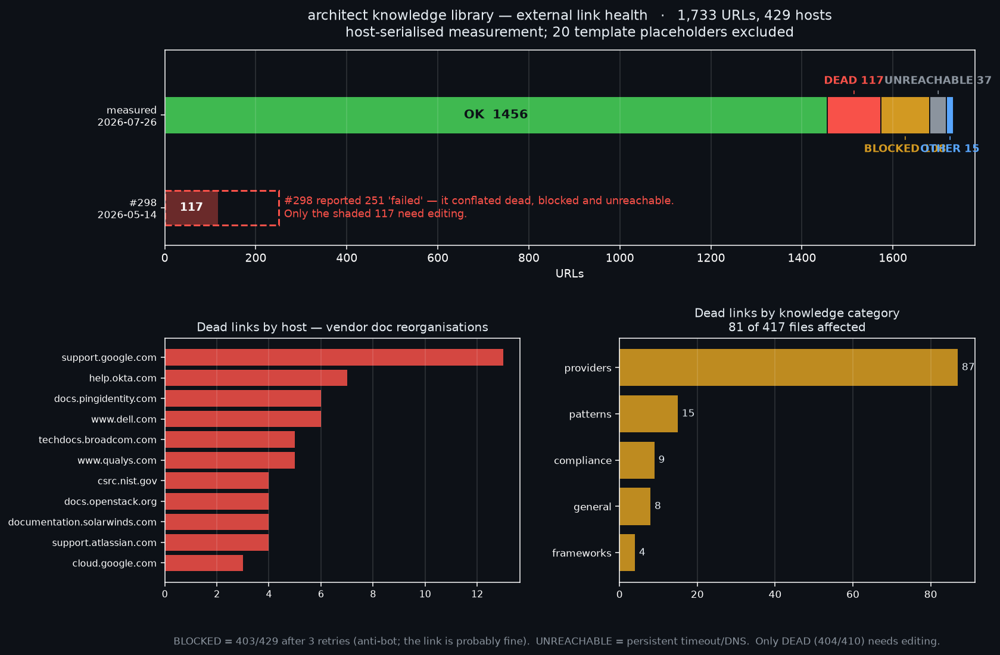

# External link health of the knowledge library

`mkdocs build --strict` validates **internal** links only. Nothing checks the
~1,700 **external** vendor-doc URLs the knowledge files cite, so they rot silently
— and they are the citations readers click on GitHub Pages and that MCP consumers
receive.

## Reproducing

```bash
# 1. extract candidate URLs, dropping template placeholders
grep -rhoE 'https?://[^ )>"'"'"'`]+' knowledge/ --include='*.md' \
  | sed 's/[.,;:]$//' | sort -u > /tmp/urls.txt
#    then filter localhost, {{ }}, <placeholders>, example.com, ALLCAPS hosts

# 2. check, host-serialised
python3 docs/link-health/linkcheck.py /tmp/urls_real.txt results.tsv 14

# 3. chart it
python3 docs/link-health/render-chart.py
```

**Throttle per host or the numbers are wrong.** 182 of the URLs share
`learn.microsoft.com`; a naive run at concurrency 8 produced 12x 429 and 10x 000
that looked like rot and were not. `linkcheck.py` runs one worker per host with a
1.1s gap and retries 429/000/5xx three times with backoff.

## Verdict categories

Only **DEAD** is actionable. Conflating these is what made the earlier estimate
(#298) more than double the real number.

| verdict | meaning | act? |
|---|---|---|
| OK | 2xx/3xx | no |
| **DEAD** | 404/410 | **yes — fix or remove** |
| BLOCKED | 403/429 after retries | no — anti-bot/paywall; a browser reaches it |
| UNREACHABLE | persistent timeout/DNS | usually no |

## Why the raw results are not committed here

An earlier attempt included the full `results.tsv` (every URL + status). The
pre-commit guard blocked it, correctly: a dump of every knowledge-library URL
placed *outside* `knowledge/` re-exports — into a path the client-data exemption
does not cover — the very vendor names that exemption exists to allow. Aggregate
counts and the chart carry the same information without that. Regenerate the raw
list locally when needed.

## 2026-07-26 baseline

1,733 real URLs, 429 hosts.

| OK | DEAD | BLOCKED | UNREACHABLE | other |
|---:|---:|---:|---:|---:|
| 1,456 | **117** | 108 | 37 | 15 |

81 of 417 knowledge files carry at least one dead link. Rot is concentrated in
vendor documentation reorganisations rather than scattered randomly, so fixes
batch by host.


