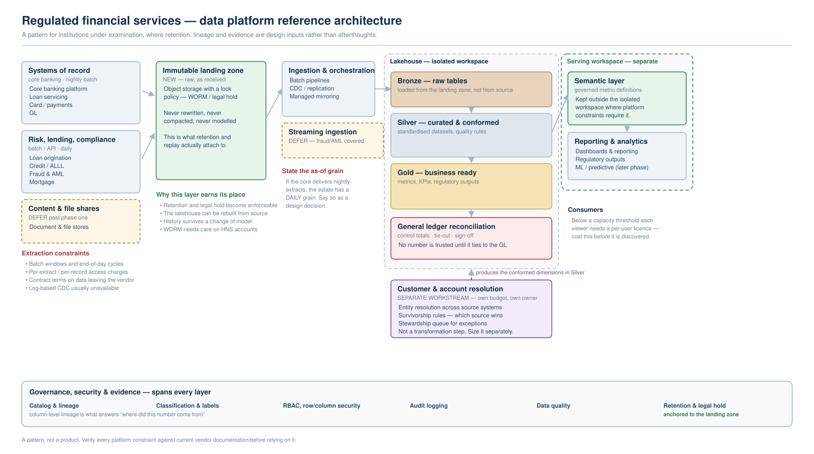

# Regulated Financial Services — Data Platform Reference Architecture

## Scope

A worked reference architecture for a data platform inside an examined financial institution, where
retention, lineage and evidence are design inputs rather than things added afterwards. Covers the
layer topology, what each layer is accountable for, and the four decisions that are routinely made
implicitly and should be made explicitly.

This is a **pattern, not a product**. It names no vendor and no institution. For platform selection
see `patterns/data-platform-selection.md`; for the constraints that shape it see
`patterns/regulated-financial-data-platform.md` and `compliance/ffiec.md`.

## Checklist

### Landing and raw

- [ ] **[Critical]** Is there an **immutable landing zone distinct from the lakehouse bronze layer** — object storage under a lock policy, holding source data exactly as received? Bronze in a table format is rewritten by compaction, snapshot expiry and file maintenance, so it cannot be the thing a retention schedule or a legal hold attaches to. Without a separate landing zone, "we retain everything" is an assertion the storage layer does not support.
- [ ] **[Critical]** Can the entire lakehouse be **rebuilt from the landing zone** without going back to the source systems? This is what makes a modelling mistake recoverable, and it is the only defence against a source system that no longer holds the history.
- [ ] **[Critical]** Have you confirmed that your object store's **immutability features work on the account type the lake actually uses**? Version-level WORM and hierarchical-namespace accounts interact badly on at least one major cloud, and the failure is silent — the policy appears set and does not apply.
- [ ] **[Recommended]** Is the landing zone written **before** any transformation, including trivial ones? A "light cleanup on ingest" is a transformation, and it destroys the property the layer exists to provide.

### Grain and reconciliation

- [ ] **[Critical]** Is the **as-of grain stated explicitly** for every source? If the system of record delivers a nightly extract, the estate has a daily grain, and downstream expectations should be set against that rather than against the architecture diagram's streaming arrows.
- [ ] **[Critical]** Does every reported figure **reconcile to the general ledger**, with control totals and a named sign-off? For a financial institution this is the acceptance criterion. A platform that produces fast numbers nobody will certify has not delivered.
- [ ] **[Recommended]** Is there a documented position on **intraday versus end-of-day state**, including memo-post versus posted? Many core systems cannot answer intraday questions at all, and discovering that after the semantic model is built is expensive.

### Identity resolution

- [ ] **[Critical]** Is customer and account resolution scoped as a **separate workstream with its own budget line and business owner**, rather than as a transformation step inside the curated layer? Drawn as a layer it gets estimated as a layer. See `general/master-data-management.md` and `patterns/entity-resolution.md`.
- [ ] **[Critical]** Are **survivorship rules** — which source wins, per attribute — decided by the business rather than defaulted by the tool?
- [ ] **[Recommended]** Is there a **stewardship queue** with an owner and an SLA, and a defined behaviour for downstream consumers while a conflict is unresolved?

### Isolation and serving

- [ ] **[Critical]** Have you enumerated which platform features are **unavailable inside a network-isolated workspace**? On at least one major platform the semantic-model layer cannot coexist with workspace-level private networking, which forces a serving workspace split that is far cheaper to design in than to retrofit.
- [ ] **[Critical]** Is **open-format portability actually available under your network configuration**? Catalog interoperability is commonly disabled when private networking is enabled, which means the portability argument and the isolation argument cannot both be made.
- [ ] **[Recommended]** Is the **per-consumer licensing cliff** modelled? Several platforms shift from capacity-based to per-user licensing below a capacity threshold, which changes the cost of a wide reporting rollout substantially.

### Governance as evidence

- [ ] **[Critical]** Is lineage sufficient to answer **"where did this number come from"** for a specific reported figure — which usually means column-level, not table-level?
- [ ] **[Critical]** Are retention and legal hold **anchored to the landing zone** rather than to the lakehouse tables?
- [ ] **[Recommended]** Can you produce **evidence on demand** — access reviews, key custody, retention enforcement — rather than reconstructing it when asked?

## Why This Matters

Most data platform designs are drawn for the happy path: sources on the left, layers in the middle,
dashboards on the right. In an examined institution, three of the four hardest questions are about
things that do not appear on that drawing — where the raw record lives, what the numbers reconcile
to, and what evidence exists that controls operate.

The architecture above differs from a generic medallion diagram in four specific ways, and each one
corresponds to a failure that is expensive to fix later:

**A separate immutable landing zone**, because a table-format layer is rewritten as a matter of
routine maintenance and cannot carry a retention obligation.

**Identity resolution as a workstream**, because when it is drawn as a layer it is estimated as a
layer — and in a post-merger or multi-source estate it is frequently the largest single body of
work in the programme.

**Reconciliation as an explicit control point**, because the acceptance criterion is trust, not
latency.

**A serving layer drawn outside the isolated workspace**, because platform constraints on network
isolation routinely make the two incompatible, and discovering that during implementation forces a
redesign of the consumption tier.

## Common Decisions (ADR Triggers)

- Landing zone in the same cloud as the lakehouse, or deliberately elsewhere for concentration risk
- Retention enforced by storage policy versus by catalog policy
- Whether the curated layer is rebuilt from landing on every material model change
- Whether identity resolution runs before or after the curated layer
- Serving workspace topology, and which side of the network boundary the semantic layer sits on
- Streaming ingestion in phase one, or deferred until a real-time consumer exists that is not already served by an operational system

## Reference Architectures

The diagram above is the base pattern. Two common variants:

**Deferred streaming.** Phase one is batch only, with the streaming path drawn but not built. This
is the right default when the genuine real-time use cases — fraud and AML monitoring — are already
served by an operational system, since duplicating them into the lake adds cost without adding
capability.

**Split serving.** Where platform constraints prevent the semantic layer from living inside the
isolated workspace, the serving tier moves to a second workspace with its own access model. This
should be a deliberate choice recorded in an ADR, not an implementation discovery.

## See Also

- `patterns/regulated-financial-data-platform.md` — key custody, residency, retention, evidence
- `patterns/core-banking-data-integration.md` — getting data out of the system of record
- `patterns/data-platform-selection.md` — choosing and defending a platform
- `patterns/lakehouse-medallion.md` — the layer pattern in general
- `general/master-data-management.md` · `patterns/entity-resolution.md` — the identity workstream
- `general/data-ingestion.md` — CDC, grain, backfill
- `general/semantic-layer.md` — metric governance and where security is enforced
- `compliance/ffiec.md` · `compliance/bank-regulatory-reporting.md`
